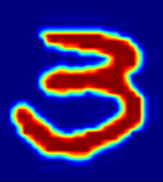

Official repository of the paper (AI for Content Creation (AICC) Workshop, CVPR 2022) ["Image2Gif: Generating Continuous Realistic Animations with Warping NODEs"](demo/paper.pdf), Warping Neural ODE.

*Repository is under construction.*

If you like our work, please give us a star. 


<!-- If you use our code in your research projects, please cite our paper as -->
<!-- ``` -->
<!-- @inproceedings{nazarovs2021variational, -->
<!--   title={A variational approximation for analyzing the dynamics of panel data}, -->
<!--   author={Nazarovs, Jurijs and Chakraborty, Rudrasis and Tasneeyapant, Songwong and Ravi, Sathya and Singh, Vikas}, -->
<!--   booktitle={Uncertainty in Artificial Intelligence}, -->
<!--   pages={107--117}, -->
<!--   year={2021}, -->
<!--   organization={PMLR} -->
<!-- } -->
<!-- ``` -->

# Visualization of experiments
## Warping MNIST


## Smiling face 
 


